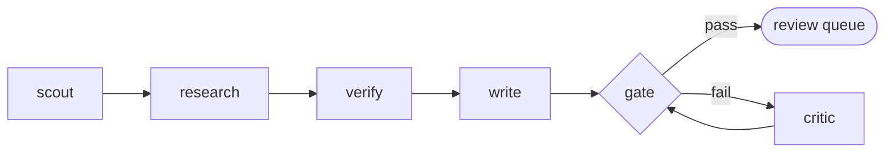

# Autonomous Insight Agent

An autonomous pipeline that researches, fact-checks, and drafts one short, data-driven "Data Insight"
per day, then drops it into a private review queue for a human to keep or kill. It is built on
[Claude Code](https://www.claude.com/product/claude-code) running headless, orchestrated by a plain
shell script, with deterministic code gates between the agent stages.

It was built to produce a backlog of ~90%-good drafts about **AI's impact on Switzerland and Europe**,
the kind that get published (after a human edit) at
[gianlucasavino.com](https://gianlucasavino.com). The whole point of this repo is that the agent
instructions are open: you can read exactly what each stage is told to do in [`prompts/`](prompts/).

**Live examples** (human-reviewed before publishing):
- [Switzerland leads the world in AI researchers per capita but ranks 14th in private AI investment](https://gianlucasavino.com/data/switzerland-ai-talent-funding-paradox/)
- [Two-thirds of Google searches now end without a click](https://gianlucasavino.com/data/zero-click-search/)

---

## How it works

The pipeline is a deterministic chain of `claude -p` (headless Claude Code) stages. Code controls the
flow; the model does each stage. Artifacts are passed file-to-file, and a deterministic gate decides
pass/fail. It is **fail-closed**: a number that cannot be traced to a source is dropped, not guessed.



| Stage | What it does |
|---|---|
| **scout** | Picks one Swiss/EU topic that has both a real source and a genuine angle, not a rephrase. |
| **research** | Gathers the numbers, each captured with its exact source quote and URL. |
| **verify** | A fresh, adversarial fact-check that tries to *break* every number, not confirm it. |
| **write** | Drafts the insight using only verified facts. |
| **gate** | Deterministic checks (code, not the model): every number traces to a verified claim, every source URL resolves, no em dashes, and the chart, methodology, and sources are present. |
| **critic** | Runs only when the gate fails, and only to fix the specific failure. |

Design choices (with the reasoning, if you want it):
- **Single deterministic pipeline, not a swarm.** The stages are linearly dependent, so they run in
  order. Model tiering: a cheaper model scouts/researches/writes, a stronger one verifies.
- **Reported vs. derived claims.** A *reported* number must trace to a source (quote + URL). A
  *derived* number (a ratio, a per-capita normalization) is allowed only if every input is a verified
  reported claim and the calculation is explicit; it is labeled as analysis, not as a source's finding.
- **The verifier is the keystone.** It runs with fresh context, separate from the researcher, and its
  job is to *break* each claim, not confirm it.
- **No blind reflection loop.** A critic pass runs only when the deterministic gate actually fails,
  and it is given the specific failure to fix.
- **Human in the loop.** The agent produces drafts, not publications. A person curates the queue and
  does the final editorial pass. This is the safety net, not an afterthought.

## What's in here

| Path | What it is |
|---|---|
| `generate.sh` | The orchestrator. Runs the five stages, the gate, and the conditional critic. |
| `prompts/` | The agent instructions for each stage (`1-scout` … `5-critic`). Read these. |
| `brief/SCOPE_AND_STYLE.md` | The spec: scope, the value bar, house style, the reported/derived rules. |
| `brief/topics.md` | Editable topic ideas the scout considers (alongside a fresh web search). |
| `brief/DRAFT_TEMPLATE.html` | The HTML skeleton the writer fills. |
| `scripts/gate.py` | The deterministic quality gate (number-match, URL liveness, house-style). |
| `scripts/build-index.py` | Rebuilds the review-queue grid from the drafts. |
| `scripts/install-caddy-route.py` | Example: adds a route to a Caddy server (author's setup). |
| `public/` | The static review-queue site (grid + a draft per folder) served by any web server. |
| `state/used-topics.json` | Dedup memory; the agent appends each topic so it never repeats. |

Generated output (`runs/`, `public/drafts/`, the built `public/index.html`) is git-ignored.

## Requirements

- [Claude Code](https://docs.claude.com/en/docs/claude-code) installed and authenticated. This uses
  the headless `claude -p` mode. Note the [June 2026 billing change](https://docs.claude.com/en/docs/claude-code/costs):
  headless runs draw a metered credit pool on subscriptions, or use an API key. One draft a day is small.
- Python 3.
- Any static web server to serve `public/` (the author uses [Caddy](https://caddyserver.com/), bound
  to a [Tailscale](https://tailscale.com/) interface so the queue is private).

## Clone and run

```bash
git clone https://github.com/gnlcsvn/autonomous-insight-agent.git
cd autonomous-insight-agent
cp state/used-topics.example.json state/used-topics.json   # start with a fresh dedup list

# Point the script at your claude binary if it isn't on PATH:
export CLAUDE_BIN="$(command -v claude)"

# Produce one draft (writes into public/drafts/<date>-<slug>/ and rebuilds the grid):
bash generate.sh

# Serve the review queue and open it:
python3 -m http.server 8000 --directory public   # then visit http://localhost:8000
```

To run it daily, wire `generate.sh` into a `cron` job or a `systemd` timer.

## Let an agent set it up for you

This pipeline is built on Claude Code, so the easiest way to adapt it is to let a coding agent do the
setup based on your requirements. Clone the repo, open Claude Code (or any coding agent) in the folder,
and describe your beat in plain language, for example:

> Read the README and the files in `brief/`. I want a daily data insight about **the global shipping
> industry**, focused on **Europe**, in a **skeptical, plain-spoken** voice. Rewrite
> `brief/SCOPE_AND_STYLE.md` and `brief/topics.md` to that beat, set `CLAUDE_BIN`, then run
> `bash generate.sh` and show me the first draft.

The agent reads the brief, rewrites the scope, style, and topic list to your requirements, and runs a
first draft. The same kind of agent that powers the pipeline can configure it for you, so you rarely
need to touch the files by hand. The section below is the manual reference for what it (or you) would
change.

## Customize it for your own beat

Everything that defines *what* it writes lives in two files, no code changes needed:

- **Topics:** add ideas to `brief/topics.md`. The scout weighs them equally against a fresh web search.
- **Scope, style, and rules:** edit `brief/SCOPE_AND_STYLE.md`. This is where the "Switzerland/Europe,
  AI's impact on work and the economy" beat is defined, along with the house style and the
  fact-vs-derived rigor rules. Change it to your own topic, region, and voice.

To tune behavior: the stage prompts are in `prompts/`; model tiering and per-stage turn caps are at
the top of `generate.sh`; the design system for the charts and pages is in `public/assets/style.css`.

## Honest limitations

- The output is a **draft**, roughly 90% there. It is meant to be curated and edited by a human, not
  published as-is.
- The adversarial verifier reduces, but does not eliminate, the risk of a wrong or misattributed
  number. Keep a person in the loop, especially for anything public.
- It is tuned for a single, short, single-chart insight per run. It is not a general research agent.

## Credits

This tool, its agent instructions (`prompts/` and `brief/`), and this README were written by Claude
(via Claude Code) together with Gian-Luca Savino. Fittingly, the same kind of agent that runs the
pipeline also helped build and document it.

## License

MIT. See [LICENSE](LICENSE).
